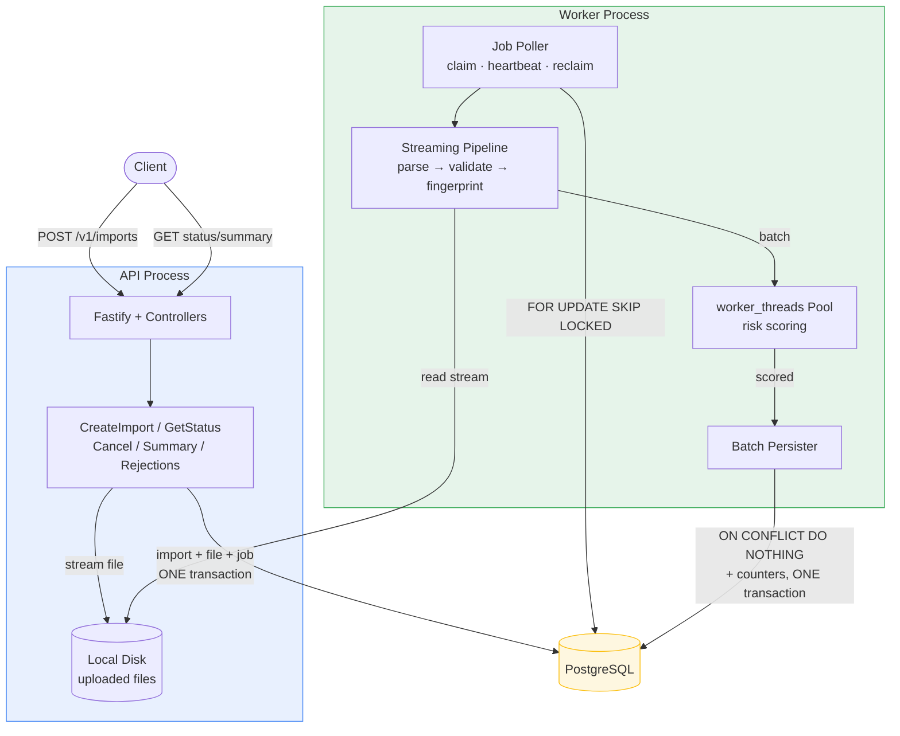
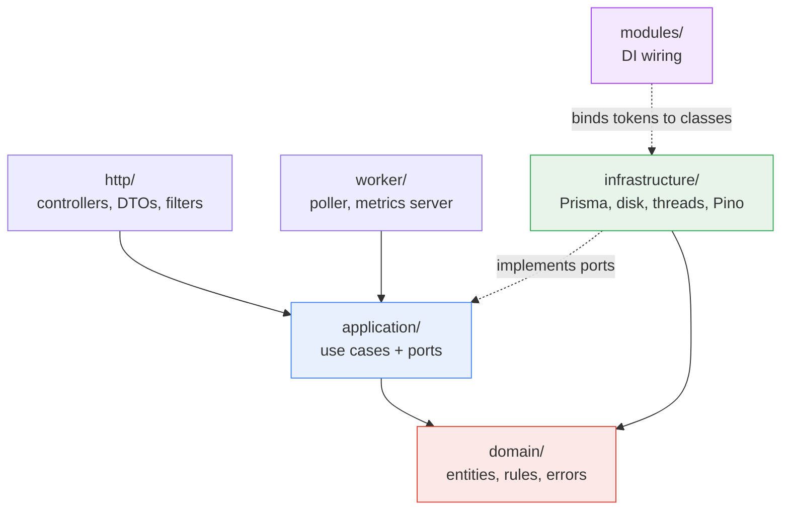
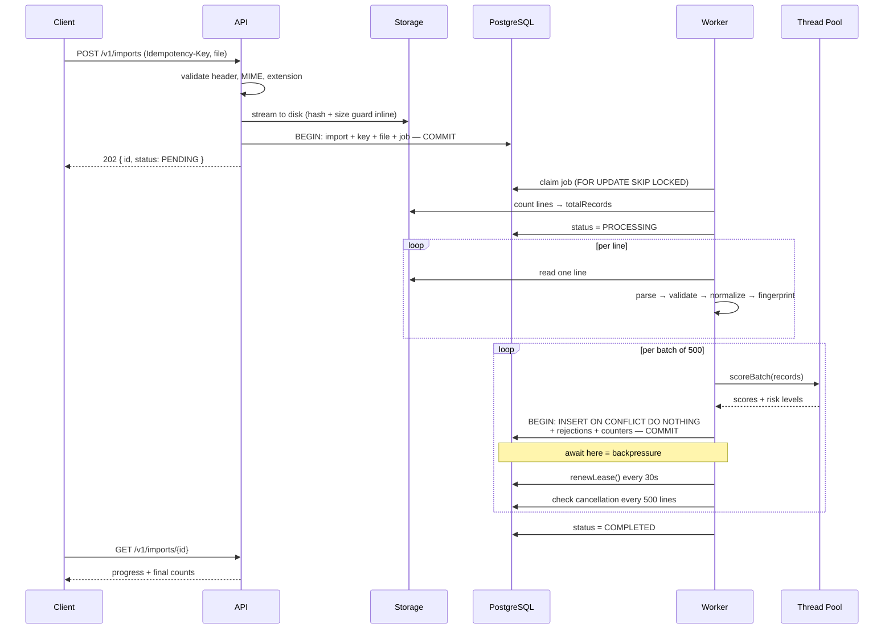
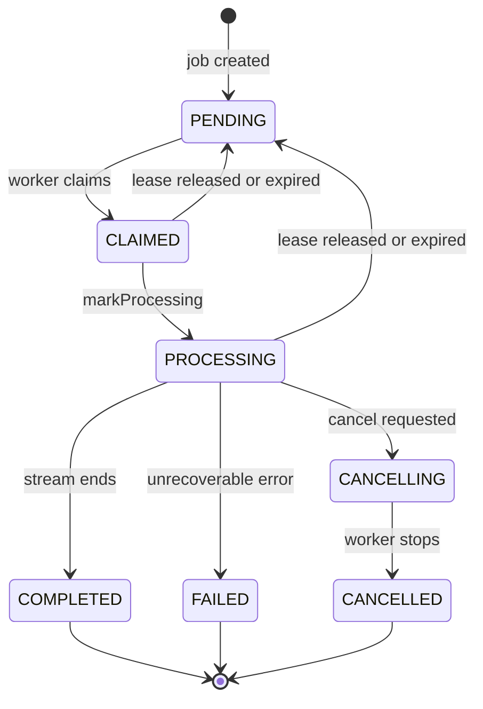

# Architecture

## System Components

Two processes sharing one codebase and one database.



**API process** — accepts uploads, streams them to storage, queues a job,
serves reads. Never parses or processes file contents.

**Worker process** — claims jobs, streams files, validates, scores risk on
threads, persists in batches. No HTTP server beyond a bare metrics endpoint.

**PostgreSQL** — data store _and_ job queue. No Redis, no message broker.

The split is deliberate: CPU-heavy processing cannot affect API latency,
and each can be scaled independently. Multiple workers coordinate safely
through database-level job leasing.

---

## Module Boundaries & Dependency Direction



**Dependencies point inward.** `domain/` depends on nothing. `application/`
depends only on `domain/`. `infrastructure/` implements interfaces defined
in `application/ports/` — the arrow points _up_, which is what inverts the
dependency.

| Layer                    | Contains                                                             | May import          |
| ------------------------ | -------------------------------------------------------------------- | ------------------- |
| `domain/`                | Validation, fingerprinting, risk scoring, state machine, error types | Node built-ins only |
| `application/ports/`     | Interfaces + DI tokens                                               | `domain/`           |
| `application/use-cases/` | Business workflows                                                   | `domain/`, ports    |
| `infrastructure/`        | Prisma, filesystem, worker threads, Pino, prom-client                | `domain/`, ports    |
| `http/`                  | Controllers, DTOs, exception filter                                  | `application/`      |
| `worker/`                | Job poller, sweepers                                                 | `application/`      |
| `modules/`               | Token → implementation bindings                                      | everything          |

**Enforced invariants:**

- `domain/` contains no framework import. It would still compile with Nest,
  Fastify, and Prisma deleted.
- `PrismaClient` is instantiated in exactly one file
  (`infrastructure/prisma/prisma.service.ts`).
- Use cases reference `FileStoragePort`, never `DiskFileStorage`.
- `modules/` is the only place a token is bound to a class.

---

## Dependency-Injection Strategy

NestJS's container, with **`Symbol` tokens bound to interfaces** rather than
classes injected directly.

```typescript
// application/ports/tokens.ts
export const TRANSACTION_REPOSITORY = Symbol('TRANSACTION_REPOSITORY');

// application/use-cases/process-import-file.use-case.ts
constructor(
  @Inject(TRANSACTION_REPOSITORY) private readonly repo: TransactionRepositoryPort,
) {}

// modules/persistence.module.ts — the ONLY binding site
providers: [{ provide: TRANSACTION_REPOSITORY, useClass: PrismaTransactionRepository }]
```

### Injected dependencies

| Port                        | Production adapter              | Test fake                           |
| --------------------------- | ------------------------------- | ----------------------------------- |
| `ImportRepositoryPort`      | `PrismaImportRepository`        | `FakeImportRepository` (a `Map`)    |
| `TransactionRepositoryPort` | `PrismaTransactionRepository`   | `FakeTransactionRepository`         |
| `JobRepositoryPort`         | `PrismaJobRepository`           | `FakeJobRepository`                 |
| `ImportQueryPort`           | `PrismaImportQuery`             | `FakeImportQuery`                   |
| `FileStoragePort`           | `DiskFileStorage`               | `FakeFileStorage` (no disk)         |
| `LineReaderPort`            | `ReadlineLineReader`            | `FakeLineReader` (an array)         |
| `RiskScoringPoolPort`       | `WorkerThreadPool`              | `FakeRiskScoringPool` (synchronous) |
| `RetryPolicyPort`           | `ExponentialBackoffRetryPolicy` | `FakeRetryPolicy` (no delays)       |
| `MetricsRecorderPort`       | `PrometheusMetricsRecorder`     | `FakeMetricsRecorder`               |
| `ClockPort`                 | `SystemClock`                   | `FixedClock`                        |
| `IdGeneratorPort`           | `UuidGenerator`                 | `SequentialIdGenerator`             |
| `LoggerPort`                | `PinoLogger`                    | `NoopLogger`                        |

### What this buys

`CreateImportUseCase` is unit-tested by calling `new` with fakes — no Nest
container, no Postgres, no filesystem. If it secretly depended on a
concrete class, that test wouldn't compile.

`ClockPort` and `IdGeneratorPort` are the clearest illustration: they exist
so `createdAt` and `id` are **generated in business logic**, not by Prisma
defaults. That makes tests deterministic, and it means identity is a
domain decision rather than a database side effect.

### Deliberately avoided

- **Global mutable containers** — Nest's container only.
- **Service locator** — constructor injection throughout; nothing calls
  `container.get()`.
- **Hidden singleton state** — even the shutdown flag is an injectable
  `ShutdownState`, not a module-level variable.
- **Infrastructure constructed inside use cases** — no `new PrismaClient()`
  outside `infrastructure/`.
- **Framework-bound business logic** — use cases take a generic `Readable`,
  not a `FastifyRequest`. A CLI or queue consumer could call them unchanged.

---

## Processing Workflow



### Stage by stage

**1 · Upload.** The `Idempotency-Key` header is required. Content type,
extension, and MIME are checked against an allowlist. The multipart stream
pipes straight to disk through a `Transform` that hashes and size-checks
each chunk — the file is never buffered. Filenames are server-generated
UUIDs; the client's is discarded.

**2 · Queue.** One transaction creates the import, idempotency key, file
record, and job row. If the key already exists, the whole transaction rolls
back and the existing import is returned. Response is 202 — nothing is
parsed in the request handler.

**3 · Claim.** A worker atomically leases one job via
`SELECT ... FOR UPDATE SKIP LOCKED`, so concurrent workers never collide.
The same query also reclaims jobs whose lease has expired.

**4 · Count.** One sequential byte-scan establishes `totalRecords`, so
progress has a denominator from the first batch. The client's claimed count
is never trusted.

**5 · Parse.** `fs.createReadStream` → `readline`, one line at a time.
Blank lines are skipped; malformed JSON and over-long lines become rejection
records rather than exceptions. `JSON.parse` never throws out of the
pipeline.

**6 · Validate & normalize.** A single pure pass: trim strings, uppercase
currency, round amounts to 2dp, parse timestamps to UTC, range-check dates,
strip control characters, cap identifier length. Unexpected fields are
dropped by construction — the result object is built explicitly, never
spread from input, which also rules out prototype pollution.

**7 · Fingerprint.** SHA-256 over an explicit ordered field list, prefixed
with a version (`v1:`). `description` is excluded because upstream systems
reformat free text between exports.

**8 · Score.** Batches of 500 go to a fixed-size `worker_threads` pool.
Scoring is deterministic and CPU-bound by design.

**9 · Persist.** `INSERT ... ON CONFLICT (provider, transactionId) DO
NOTHING RETURNING id` — the returned count gives an exact duplicate tally.
Transactions, rejections, and counter increments commit in one transaction.

**10 · Complete.** Terminal status written; the trailing partial batch is
flushed first so no records are silently dropped.

---

## Database Consistency Strategy

**Everything that must agree, commits together.**

```typescript
await prisma.$transaction(async (tx) => {
  await tx.$queryRaw`INSERT INTO transactions ... ON CONFLICT DO NOTHING RETURNING id`;
  await tx.rejectedRecord.createMany({ ... });
  await tx.import.update({ data: { processedCount: { increment: n }, ... } });
});
```

This makes the classic dual-write failure — "the batch succeeded but the
progress update failed" — **structurally impossible**. Either all three
land or none do.

Constraints, not application checks, enforce correctness:

| Constraint                          | Prevents                                            |
| ----------------------------------- | --------------------------------------------------- |
| `UNIQUE (provider, transactionId)`  | Duplicate transactions, across imports and restarts |
| `UNIQUE (idempotency_keys.key)`     | Duplicate imports under concurrent requests         |
| `UNIQUE (processing_jobs.importId)` | Two jobs for one import                             |

**Honest caveat.** Counter increments are not constraint-protected. If a
worker crashes mid-file and another reprocesses it, already-committed
batches increment `processedCount` again. `acceptedCount` stays correct
(derived from `RETURNING id`, which returns nothing on a full-conflict
retry) and `totalRecords` stays correct (written absolutely), but
`processedCount` can overshoot.

---

## Retry Strategy

Applied to **exactly one operation**: batch database writes.

### Why that operation is safe to retry

Not asserted — it follows from two properties:

1. `persistBatch` is a single transaction, so a failure leaves nothing
   partially written.
2. The unique constraint makes a re-insert a no-op, so a retry after an
   ambiguous failure cannot duplicate rows.

### Classification is explicit

`DomainError` carries a `retryable` flag set at construction. Raw driver
errors are matched against an allowlist of transient SQLSTATEs (`08006`
connection failure, `40001` serialization, `40P01` deadlock, `53300` too
many connections, `57P0x` shutdown) and Node network codes.

**Never retried:** validation errors, the entire `23xxx` constraint class,
business-rule violations, cancellations, and programming errors. Retrying
these cannot succeed.

### Storm prevention

Four independent bounds:

- **Exponential backoff** — 200ms → 400ms → 800ms, capped at 5s.
- **Full jitter** — the delay is random within `[0, ceiling]`, not the
  ceiling itself. This is what actually prevents storms: fixed delays would
  make N failed workers all retry at the same instant, re-loading a database
  precisely as it tries to recover.
- **Bounded attempts** — 4 total, then the job fails with a reason.
- **Bounded upstream concurrency** — at most 2 batch writes in flight per
  worker, so total concurrent retries are bounded by `workers × 2`.

The driver-adapter cause chain is traversed to a bounded depth, since
`@prisma/adapter-pg` nests the real SQLSTATE under `.cause.originalCode`.

---

## Cancellation Strategy

**Cooperative, not preemptive.**

`POST /:id/cancel` sets both the import and job to `CANCELLING` in one
transaction (they must not drift — the worker polls the job, the API reports
the import) and returns 202. Terminal states are rejected with 409;
re-cancelling while already `CANCELLING` is idempotent.

The worker checks status every 500 lines and `break`s out of its loop. That
`break` triggers the line reader's `finally` block, closing the stream and
file handle — so cleanup needs no explicit plumbing in the use case.

**Pending work is still flushed before stopping.** Discarding it would make
`processedCount` disagree with what is actually stored.

Checking every line would mean a database round-trip per record. 500 is the
chosen middle ground; the cost is that cancellation takes effect within
roughly that many records.

---

## Graceful-Shutdown Strategy

### API

```
SIGTERM
  ├─ shutdownState.begin()   → /health/ready returns 503 immediately
  ├─ drain 3s                → load balancer stops routing new requests
  ├─ close HTTP server       → refuse new, finish in-flight
  ├─ Nest hooks              → Prisma, samplers
  └─ exit(0)                   ⏱ 15s deadline → exit(1) + loud log
```

The drain pause matters: closing immediately handles in-flight requests
correctly but drops ones routed in the moments before readiness flips.

### Worker

```
SIGTERM
  ├─ shutdownState.begin()   → poller stops claiming new jobs
  ├─ finish current job, then releaseLease() → back to PENDING
  ├─ terminate thread pool   → queued tasks rejected, not left hanging
  ├─ Nest hooks
  └─ exit(0)                   ⏱ 30s deadline → exit(1)
```

Releasing the lease is about **recovery speed, not correctness**. Either way
the job gets reprocessed — but leaving it `CLAIMED` means waiting out the
full lease TTL before anyone touches it.

### The deadline

Any step can hang. Without a deadline the process ignores SIGTERM, the
orchestrator SIGKILLs it anyway, and nothing was cleaned up. A self-imposed
deadline means _we_ choose when to give up, and can name the stuck step:

```
worker: GRACE PERIOD EXCEEDED — Step "shutdown-scoring-pool" did not
complete within 30000ms. Leases will be reclaimed on next worker start.
```

A second Ctrl-C exits immediately.

**Shutdown is not a failure.** `ShutdownInterruptedError` is categorized as
cancellation, so an interrupted job returns to `PENDING` rather than being
marked `FAILED` with a reason that reads like a bug.

---

## Duplicate-Detection Strategy

**The database is the mechanism.** No in-memory `Set`, no pre-check `SELECT`.

```sql
INSERT INTO transactions (...) VALUES (...)
ON CONFLICT (provider, "transactionId") DO NOTHING
RETURNING id;
```

`RETURNING id` yields only rows that landed, so
`duplicates = batch.length − inserted.length` is exact. Raw SQL is used
rather than Prisma's `skipDuplicates` because the latter doesn't report
_which_ rows were skipped.

Why this beats an in-memory set:

- Works **across imports** — the same transaction in a later file is still a
  duplicate.
- Survives **restarts** — no state to lose.
- Safe under **concurrency** — no check-then-act race.
- **Bounded memory** — no growing set for a 500k-record file.

**Policy: first-write-wins.** The stored row is never overwritten. Where the
incoming fingerprint differs, the record is logged as `CONTENT_MISMATCH`
rather than plain `DUPLICATE`, so genuine upstream amendments are
distinguishable.

Trade-off: a legitimate correction is rejected rather than applied.
Accepting corrections would need last-write-wins (making re-imports
destructive and order-dependent) or an explicit revision field the input
format doesn't provide.

---

## Event-Loop Protection

Three mechanisms:

**1 · Process separation.** CPU-heavy work is in a different process
entirely. API latency cannot be affected by import processing.

**2 · Worker threads.** Risk scoring runs on a fixed-size `worker_threads`
pool created once at startup. Without it, scoring would block the _worker's_
main loop, starving its cancellation checks, lease heartbeats, and batch
writes.

**3 · Streaming everywhere.** No operation loads a whole file into memory,
so no single tick does unbounded work.

Measured via `monitorEventLoopDelay()` and `eventLoopUtilization()`, sampled
every 5s in **both** processes and exposed as gauges. Percentiles reset per
window so one startup spike doesn't skew p99 permanently.

**Worth stating plainly:** the API's low latency during processing is partly
just process isolation — it would hold with or without a thread pool. The
figure demonstrating the pool specifically is the _worker's_ event-loop p99.

---

## Backpressure Strategy

```
readLines → validate → scoreBatch() → persistBatch()
    ↑                        ↑              ↑
    └─ pauses here, because ─┴──────────────┘
       `await flush()` doesn't return until both complete
```

The `await` inside the read loop is the entire mechanism. While pending, the
`for await` loop is suspended, so the reader stops pulling bytes from disk.
Only one batch is ever in flight per iteration, so unpersisted batches cannot
accumulate.

Explicit bounds at every stage:

| Stage        | Bound                                               |
| ------------ | --------------------------------------------------- |
| Line reading | 1 line at a time (`for await`)                      |
| Risk scoring | `WORKER_POOL_SIZE` threads, 500 records per message |
| Batch writes | `MAX_CONCURRENT_PERSISTS` via a counting semaphore  |

No unbounded `Promise.all(records.map(...))` anywhere — that pattern would
open one operation per record, exhausting the connection pool on a large
file.

`backpressure_waits_total` increments whenever the persist stage was
saturated at flush time, making the mechanism observable rather than assumed.

**Proof is comparative:** peak memory should stay flat across a 10× file-size
increase. Absolute memory in one run proves little.

---

## Failure-Recovery Strategy

### Delivery guarantee

> **Effectively-once record persistence via idempotent batch upserts plus a
> unique constraint, over at-least-once job delivery at the batch level.**

A job may be processed more than once; records are never duplicated.

### Lease-based recovery

A lease is a temporary, expiring claim: `leasedBy` (who) and `leasedUntil`
(until when). It converts an unanswerable question — "is that worker
alive?" — into a trivial one: "has the deadline passed?"

A healthy worker renews every 30s against a 2-minute lease. A dead worker
stops renewing, the lease lapses, and any worker's next sweep reclaims it.



### Reclaim

Runs at worker startup **and** every 30s while idle. Startup-only would miss
the common case: restarting _before_ a crashed lease expires finds nothing,
and nothing would ever check again.

`attemptCount` increments per claim. Beyond `MAX_JOB_ATTEMPTS`, a job is
marked `FAILED` instead of reset — otherwise a file that reliably kills
workers would consume capacity forever.

**Why recovery isn't instant:** reclaim cannot distinguish "dead worker"
from "slow worker", so it must wait out the lease rather than risk two
workers processing the same file concurrently.

### Other recovery paths

| Failure                               | Handling                                                                 |
| ------------------------------------- | ------------------------------------------------------------------------ |
| Transient DB error mid-batch          | Retried with backoff; transaction rolls back cleanly                     |
| Scoring thread crashes                | Task rejected, thread respawned — the pool doesn't silently shrink       |
| Orphaned upload files                 | Hourly sweep removes files >24h old that no import references            |
| Partial file on failed upload         | Deleted on every failure path in `save()`                                |
| Interrupted upload (truncated stream) | Detected via `.truncated`; partial file deleted and the request rejected |
